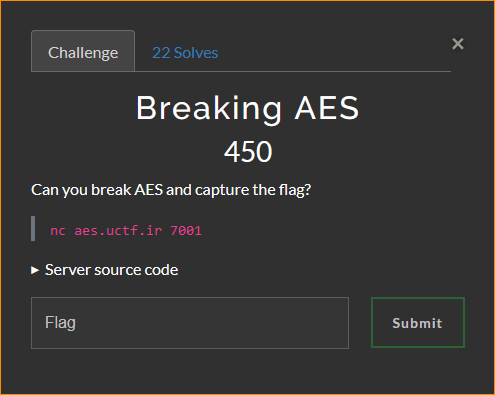

# Breaking AES

by Oblivion

## The Challenge



## The Solution

reading from the source code we see the vulnerable function __encrypt:

```python
def __encrypt(self, message: bytes) -> bytes:
        random.seed(int(time.time()) * len(message))
        nonce = random.randbytes(CryptorServer.IV_LEN)

        cipher = AES.new(self.__key, AES.MODE_CTR, nonce=nonce)
        ciphertext = cipher.encrypt(message)

        return base64.b64encode((nonce + ciphertext)) + b'\n'
```

If you search for `AES CTR exploit` you'll end finding this poc (<https://gist.github.com/allanup/821bcf5a0a8841100893261c8042d8a0>) which we will use to get the flag.

The plan is simple: we have to generate an encrypted cypher text with same nonce as the encrypted flag and then use it to retrieve the flag.

The time is rounded, so we have one second to win a race condition so that the seed will still be the same, but first we need to find the message length.

I've tried different inputs, in my case i used `aaaaaaaaaaaaaaaaaaaaaaaaaaaa` (28 characters), but you can use any string with the same length to generate an encrypted output with the same length as the encrypted text.

Then you have to spam that string as fast as you can to win the race condition, in my case the encrypted flag i got was `XnVUirwi+rsH6mrmwSURusTiGrrIKcDg8pNlzP3wgFqleq1W` while my encrypted flag was `XnVUirwi+rsT6H/h2yBBv/r6S672ItS0pK1m36+limTwKPlK`, as you can see the first characters are the same, so we know that the prepended 8 byte nonce is the same.

So i modified the exploit a little bit to make it work in our case:

```python
def main():
    """
    chosen_ciphertext and target_ciphertext should be in the binary encrypted
    format, so prepare it by base64 decoding it, or whatever.
    chosen_plaintext should be in the resulting binary/ASCII format of the
    origial data.
    """
    chosen_plaintext = 'aaaaaaaaaaaaaaaaaaaaaaaaaaaa'
    chosen_ciphertext = base64.b64decode('XnVUirwi+rsT6H/h2yBBv/r6S672ItS0pK1m36+limTwKPlK')[8:]

    keystream = derivekeystream(chosen_ciphertext, chosen_plaintext)
    target_ciphertext = base64.b64decode('XnVUirwi+rsH6mrmwSURusTiGrrIKcDg8pNlzP3wgFqleq1W')[8:]

    print decrypt(keystream, map(ord, target_ciphertext))
```

## The Flag

and then i retrieved the flag `uctf{d1d_y0u_ju57_br34k_435}`.
