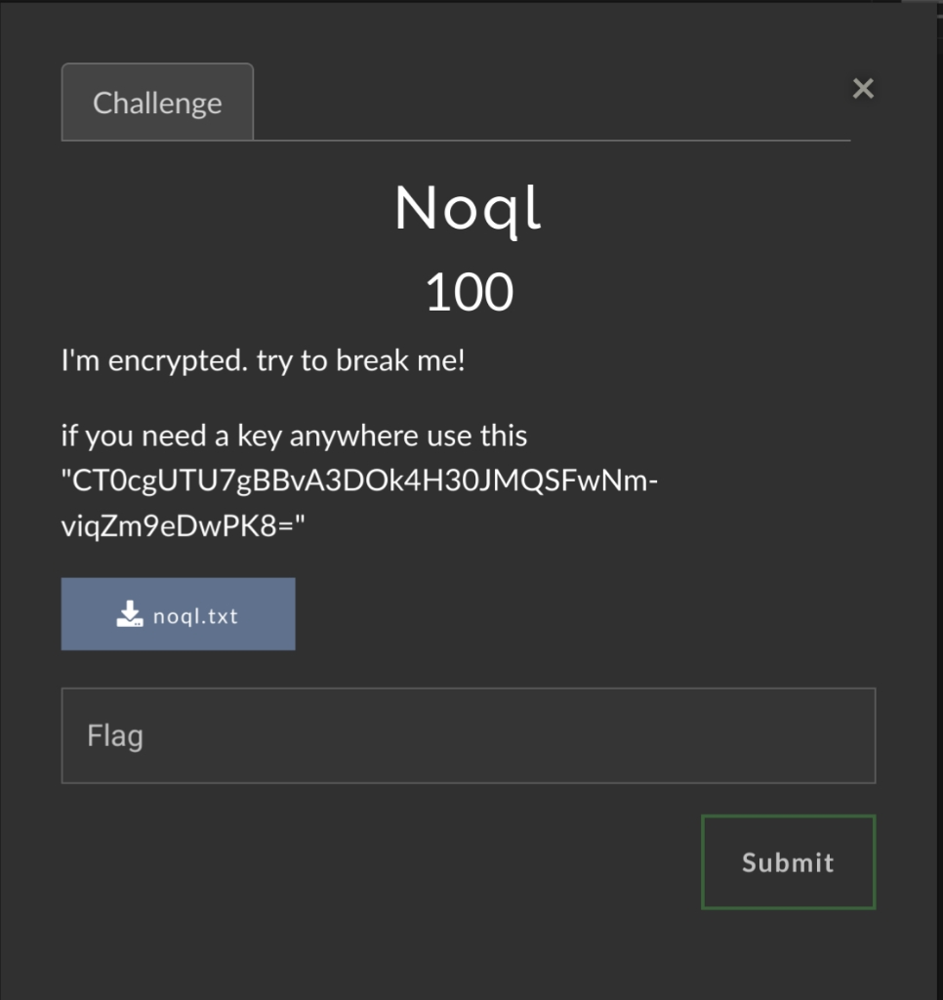
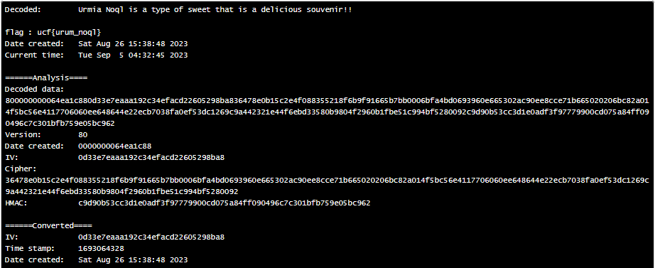

# Urmia CTF | Cryptography | Noql

by 0x54

# The Challenge

We've been provided with the following:
- A mysterious key:
   
  ```
  CT0cgUTU7gBBvA3DOk4H30JMQSFwNm-viqZm9eDwPK8=
  ```
- An encrypted flag from the attached file :
  
  ```
  gAAAAABk6hyIDTPn6qoZLDTvrNImBSmLqDZHjgsVwuTwiDVSGPa5-RZlt7sABr-kvQaTlg5mUwKskO6MznG2ZQICBryCoBT1vFbkEXcGBg7mSGROIuy3A4-g71PcEmnJpEIyHkT269M1gLmATylgsfvlHJlL9SgAksnZC1PMPR4K3z-Xd5kAzQdahP8JBJbHwwG_t1ngW8li
  ```

We can work with that. Let's dive into it!

To obtain our flag, we must, of course, decrypt it, but how? 



---
## Table of Contents
- [Gathering Information](https://github.com/ResetSec/UrmiaCTF/new/main/Crypto/Noql#gathering-information)
  - [Taking a Closer Look](https://github.com/ResetSec/UrmiaCTF/new/main/Crypto/Noql#taking-a-closer-look)
    - [Characteristincs of a Base64-encoded String](https://github.com/ResetSec/UrmiaCTF/new/main/Crypto/Noql#characteristics-of-a-base64-encoded-string)
  - [A Leap of Faith](https://github.com/ResetSec/UrmiaCTF/new/main/Crypto/Noql#a-leap-of-faith)
- [A Cryptographic Breathrough](https://github.com/ResetSec/UrmiaCTF/new/main/Crypto/Noql#a-cryptographic-breakthrough)
- [Capturing the Flag](https://github.com/ResetSec/UrmiaCTF/new/main/Crypto/Noql#capturing-the-flag)
- [Additional Resources](https://github.com/ResetSec/UrmiaCTF/new/main/Crypto/Noql#additional-resources)
---

## Gathering Information

From just looking at the surface, there are some potential clues that we can observe from the token:
1. The token starts with a prefix that doesn't seem very random: ``gAAAAA``.
2. The token seems to be base64-encoded, it only contains URL-safe characters.

We've also been provided a key that seems to be [base64-encoded](https://www.microfocus.com/documentation/enterprise-developer/ed60/ES-WIN/BKCJCJDEFNS009.html).

### 1. Taking a Closer Look

#### Characteristics of a Base64-encoded String:
- The length is always a multiple of 4.
  - The ***total length*** of the string, including the optional padded ``=`` symbols must be divisible by 4 without leaving a remainder. 

- Only characters from the following regex are used: ``/^[A-Za-z0-9\+/]+[=+$?]{0,2}/``, where 
  - All of the characters used in the key consist of only alphanumeric characters, ``+``, ``/``, and it may contain 0-2 ``=``.

- The ***end*** of the string may be padded up to two times with ``=``, but no more than that.
  - The string may contain no ``=`` at all, but the total number of ``=`` must not be greater than 2.

It certainly seems to check out. ***HOWEVER***, it does not always mean that it will definitely be a base64-encoded string.

In our case, the token and key both decode into gibberish. There is still a possibility that the text must have been encoded in another way *prior* to being encoded in base64.

### 2. A Leap of Faith

While not always the case with encrypted text, there seems to be pattern in the token which contains our encrypted flag. As mentioned earlier, it starts with the prefix ``gAAAAA``.

For a string that is supposed to contain a garble of 'randomised' characters, the probability of these repeated chracters occuring back to back five different times is extremely low. Very suspicious...

Let us confirm this with a bit of Google wizardry, with the search query ``encryption algorithm start* "gAAAAA"``

. . .

We're met with [a different CTF write-up](https://medium.com/@weareintentions/noobctf-0x01-writeups-f88ff8657eed) as our first search result. 

*Truly magical.*

## A Cryptographic Breakthrough

On this article we've stumbled upon, there is another token there that we are able to compare our token with. Upon comparing the two tokens, we can see that the ``gAAAAAB`` prefix seems to consistent across both tokens.

The article also mentions an encryption algorithm that is referred to as "Fernet". *Naturally*, that brings us to an important question, 'WHAT the heck is a "Fernet"?'

Put simply:
1. It's a symmetric encryption algorithm that is also URL-safe, which makes it very convenient for web applications to handle these encrypted tokens.
2. "Symmetric" in this case means that the algorithm uses the same key for both encryption and decryption processes.
3. The generated key consists of a base64-encoded string, and it is encoded in a way that it is also url-safe (i.e. *base64url*).\*
   - \**Note: URL-safe base64 encoding will replace any forward slashes (``/``) with hyphens instead (``-``)*
5. Anyone that gets ahold of the key is able to decrypt the message that has been encrypted using that same key.

Looking back at the token we were provided in  and the key together, we can confirm that this is what we're looking for.

## Capturing the Flag

We have both the [token](images/20230904_IMGPPE_0.jpg) and the [key](files/noql.txt).

Now that we understand that Fernet uses the same key for both encryption and decryption, the only thing left is to decrypt the token and capture our flag.

After some more Google wizardry, I came across [this very helpful website](https://asecuritysite.com/tokens/ferdecode), which made the decryption process a breeze.

Upon inputting the token and key, we are able to successfully decrypt the message (yay!):



This shows us the following information after it has been fully decrypted:
- A message
- Our flag, of course
- Metadata
  - The timestamp at the time and date of encryption
  - The 'current' timestamp at the time and date of decryption

---
# Additional Resources

If you are interested in the technical details, I highly recommend taking a look at [the Fernet Spec(ification) document](https://github.com/fernet/spec/blob/master/Spec.md)\*\* which explains more about how the algorithm works.

[Here is a Medium article](https://medium.com/asecuritysite-when-bob-met-alice/passing-encrypted-tokens-the-fernet-way-ef9b2a9d125d) from [the person](https://www.youtube.com/billbuchanan) behind the website ``https://asecuritysite.com`` that was used for decrypting the Fernet token.

\*\**Note: (If the Fernet Spec link is no longer accessible, [here is an archived copy](https://web.archive.org/web/20230505131522/https://github.com/fernet/spec/blob/master/Spec.md) instead.)*
