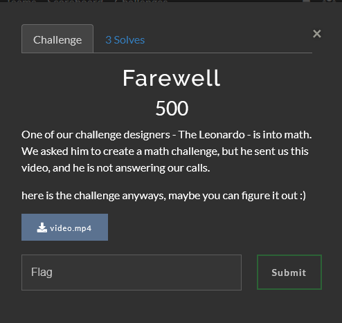
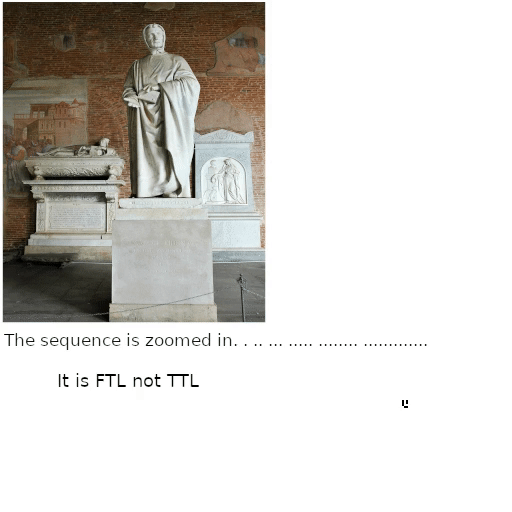
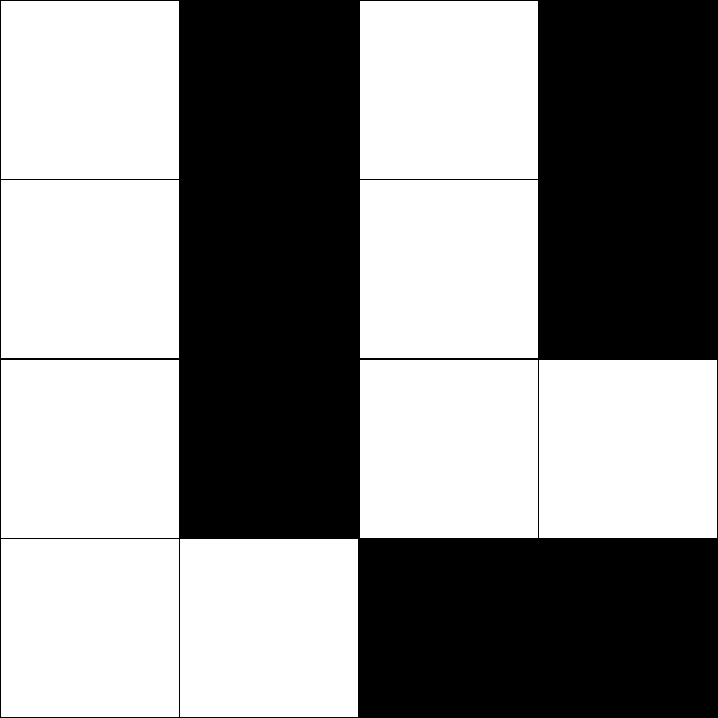
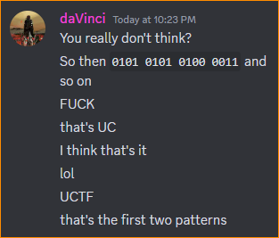

# Farewell 

by daVinci

## The Challenge



## The Video

The video provided by the challenge was the following:



### Notice the weird pattern in the bottom corner?

So, I did what any sane person would do, and I opened it in MPV, moved through the video frame-by-frame, and collected all the patterns in the form of a 4-by-4 grid.

I wanted to collect the pattern in a controlled and easy-to-compare way. So I wrote a [p5.js](https://p5js.org/) script very, very quickly in the [online editor](https://editor.p5js.org/).

<sup>Wanna learn more about p5.js.. check out this fantastic YouTube channel [The Coding Train!](https://www.youtube.com/@TheCodingTrain/playlists)<sup>

Anyway, here's the script and patterns.

## The Patterns

### Script to generate patterns

```javascript
let gridSize = 4;
let squareSize;
let grid = [];

function setup() {
  createCanvas(400, 400);
  squareSize = width / gridSize;

  // Initialize the grid with empty squares
  for (let i = 0; i < gridSize; i++) {
    grid[i] = [];
    for (let j = 0; j < gridSize; j++) {
      grid[i][j] = 0; // 0 represents an empty square
    }
  }
  
  // Create a download button
  downloadButton = createButton('Download Screenshot');
  downloadButton.position(10, height + 10);
  downloadButton.mousePressed(downloadScreenshot);
}

function draw() {
  background(220);

  // Draw the grid
  for (let i = 0; i < gridSize; i++) {
    for (let j = 0; j < gridSize; j++) {
      if (grid[i][j] === 1) {
        fill(0); // Solid black
      } else {
        fill(255); // Empty square
      }
      rect(i * squareSize, j * squareSize, squareSize, squareSize);
    }
  }
}

function mousePressed() {
  // Toggle the state of the square that was clicked
  let col = floor(mouseX / squareSize);
  let row = floor(mouseY / squareSize);

  if (col >= 0 && col < gridSize && row >= 0 && row < gridSize) {
    grid[col][row] = 1 - grid[col][row]; // Toggle between 0 and 1
  }
}

function downloadScreenshot() {
  // Create an off-screen graphics buffer to capture the screenshot
  let buffer = createGraphics(width, height);
  buffer.background(220);

  // Draw the grid on the buffer
  for (let i = 0; i < gridSize; i++) {
    for (let j = 0; j < gridSize; j++) {
      if (grid[i][j] === 1) {
        buffer.fill(0); // Solid black
      } else {
        buffer.fill(255); // Empty square
      }
      buffer.rect(i * squareSize, j * squareSize, squareSize, squareSize);
    }
  }

  // Save the buffer as an image file
  buffer.save("screenshot.png");
}

```

### The patterns in order



.png)

.png)

.png)

.png)

.png)

.png)

.png)

.png)

.png)

## What's the encoding?

The team was throwing out ideas for a bit, and at some point, one of the team members suggested that the encoding is simply a bit representation of the grid.

And I quote: "Yeh i feels like the flag maybe a sequence of number 9 numbers as you pointed out . Fibo has noting to do with char"

That caused me to reevaluate my life and just say the following:



Well, that was it.. top left -> bottom right, 1 for black and 0 for white.

Here's the [CyberChef](https://gchq.github.io/CyberChef/) breakdown of the solution.

.png)

## The Flag

`UCTF{G00dby3_fr13nd}`
