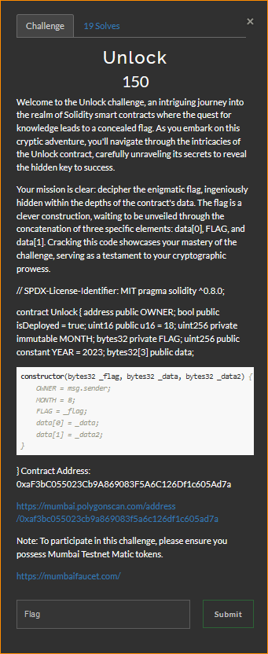

# Unlock

by fire lord of the west

## The Challenge 



## The Solution

The source code of the contract is an ERC20 token .  So once a contracted is deployed on the chain , we can  interact withit through  `web3` library . 

Analyzing the source i can see : 
1. `OWNER`: An address variable that stores the address of the contract owner.
2. `isDeployed`: A boolean variable indicating whether the contract is deployed (set to `true` by default).
4. `MONTH`: An immutable uint256 variable with a value of 8.
5. `FLAG`: A private and immutable bytes32 variable.
6. `YEAR`: A public constant uint256 variable with a value of 2023.
7. `data`: A public array of bytes32 with a length of 3.


I wrote a script to automate getting the flag . There are couple things need to be done to get this script to work . 

1. Obtain the contract [abi]() . By using Remix (A solidity IDE) . Put in the contract source code ,compile it and  obtain the abi . It's the `contract_abi` in my script

 2. Obtain a polygon test url  i found it [here](https://chainlist.org/chain/80001) . I guess you can use any of them . 

So it said `data(0)+flag+data(1)` but `flag` is a private variables so we could not read them like i did with the `data`,  so i tried searching on google and it said to use `web3.eth.get_storage_at` to read a private variable , so i tried , and  boom .

```python 
from web3 import Web3

# Replace with your Ethereum or Polygon node URL
node_url = "https://polygon-testnet.public.blastapi.io"  # Replace with your actual node URL

# Replace with the contract address
contract_address = "0xaF3bC055023Cb9A869083F5A6C126Df1c605Ad7a"  # Replace with the actual contract address
contract_abi=[
	{
		"inputs": [
			{
				"internalType": "bytes32",
				"name": "_flag",
				"type": "bytes32"
			},
			{
				"internalType": "bytes32",
				"name": "_data",
				"type": "bytes32"
			},
			{
				"internalType": "bytes32",
				"name": "_data2",
				"type": "bytes32"
			}
		],
		"stateMutability": "nonpayable",
		"type": "constructor"
	},
	{
		"inputs": [],
		"name": "OWNER",
		"outputs": [
			{
				"internalType": "address",
				"name": "",
				"type": "address"
			}
		],
		"stateMutability": "view",
		"type": "function"
	},
	{
		"inputs": [],
		"name": "YEAR",
		"outputs": [
			{
				"internalType": "uint256",
				"name": "",
				"type": "uint256"
			}
		],
		"stateMutability": "view",
		"type": "function"
	},
	{
		"inputs": [
			{
				"internalType": "uint256",
				"name": "",
				"type": "uint256"
			}
		],
		"name": "data",
		"outputs": [
			{
				"internalType": "bytes32",
				"name": "",
				"type": "bytes32"
			}
		],
		"stateMutability": "view",
		"type": "function"
	},
    {
        "constant": True,
        "inputs": [],
        "name": "FLAG",
        "outputs": [{"name": "", "type": "bytes32"}],
        "payable": False,
        "stateMutability": "view",
        "type": "function",
    },
	{
		"inputs": [],
		"name": "isDeployed",
		"outputs": [
			{
				"internalType": "bool",
				"name": "",
				"type": "bool"
			}
		],
		"stateMutability": "view",
		"type": "function"
	},
	{
		"inputs": [],
		"name": "u16",
		"outputs": [
			{
				"internalType": "uint16",
				"name": "",
				"type": "uint16"
			}
		],
		"stateMutability": "view",
		"type": "function"
	}
]

# Create a connection to the Ethereum or Polygon node
web3 = Web3(Web3.HTTPProvider(node_url))

# Create a contract instance
contract = web3.eth.contract(address=contract_address, abi=contract_abi)

# Extract the flag using the provided logic
print(contract.functions.YEAR().call())
data=contract.functions.data(0).call().decode('utf-8')
flag=web3.eth.get_storage_at(contract_address,1).decode('utf-8')
data2=contract.functions.data(1).call().decode('utf-8')


flag = data+flag+data2 

# Convert the bytes32 flag to a string

print("Flag:", flag)
```