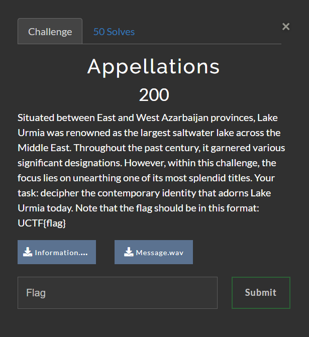

# Urima CTF | Misc | Appellations 

by h04x

### Challenge Description 



Downloadable files: 
[Message.wav](./Message.wav)
[Information.mp3](./Information.mp3)

#### Analyzing the Files

When listening to the Message.wav we can hear something that sounds like morse code, but we will come to that later.
Listening to the Information.mp3 sounds like it was reversed.

#### Reversing the Information.mp3 

Using an online tool i reversed the mp3 and got [this](./Information-reversed.mp3)

```Enjoying the Party? In this Challenge you should uncover a covered message encoded within an audio recording set at 20 WPM and 600 hertz frequenzy```

This is probably related to the morse code we got in the Message.wav
So let's decode that one!.

#### Decoding the Morse Code

Using an online tool that i set to 20 WPM and 600 hertz i decoded the Message.wav and got this:

```7U2QU01535011741230F4242841J4N```

And this is our flag!!!

`FLAG: UCTF{7U2QU01535011741230F4242841J4N}`
