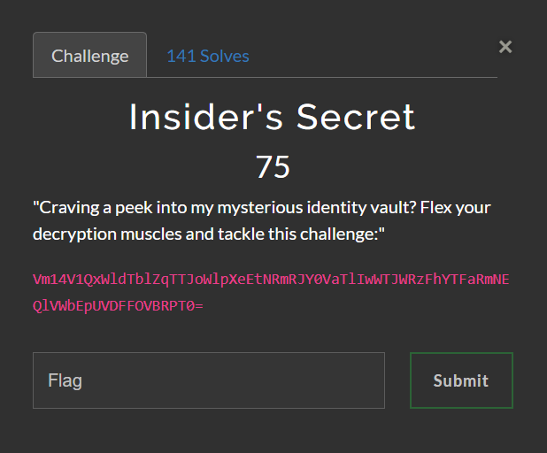
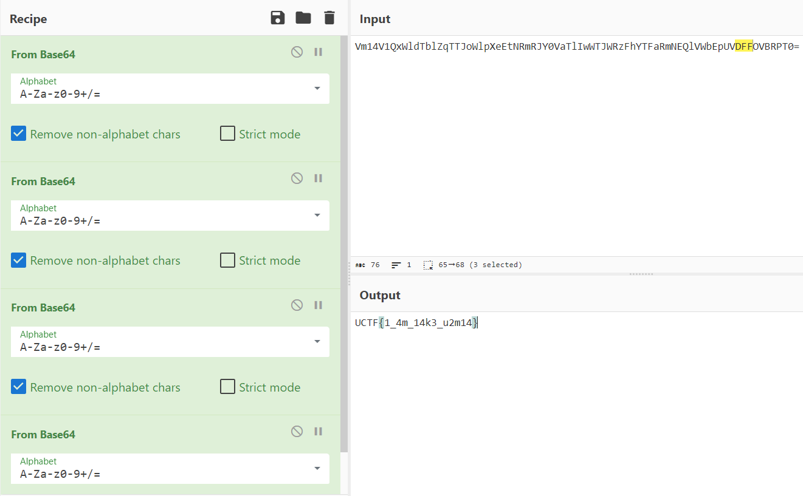

# UrmiaCTF | Misc | Insider's Secret

### Challenge Description 

#### Analyzing the String

Looking at the String they gave us i can already determin that that's Base64 encoded.
So we use Cyberchef to decode it.
But this gives us another Base64 encoded String.
We have to decode it 4 times to get the flag

`FLAG: UCTF{1_4m_14k3_u2m14}`
