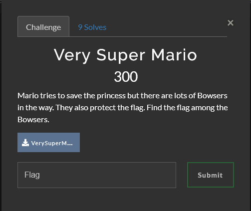
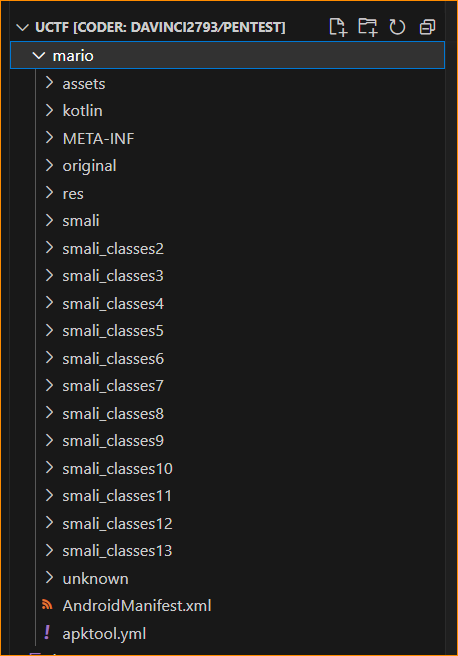
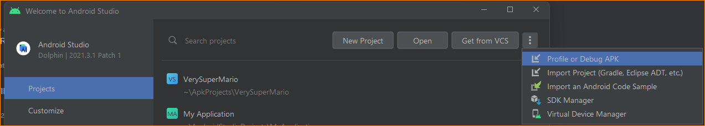
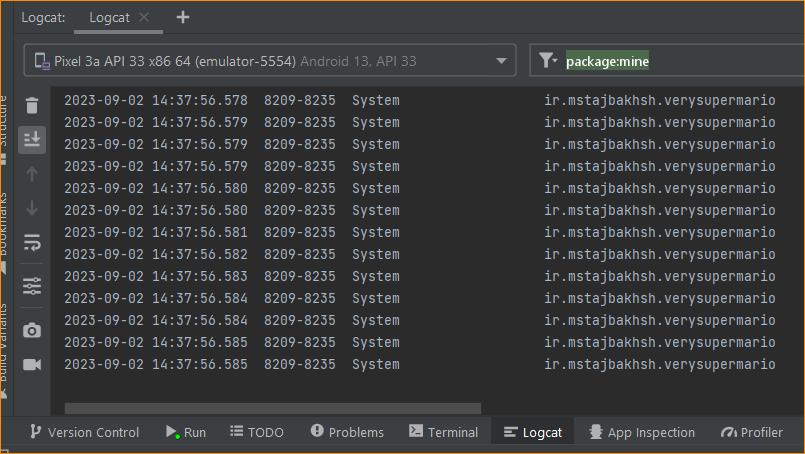
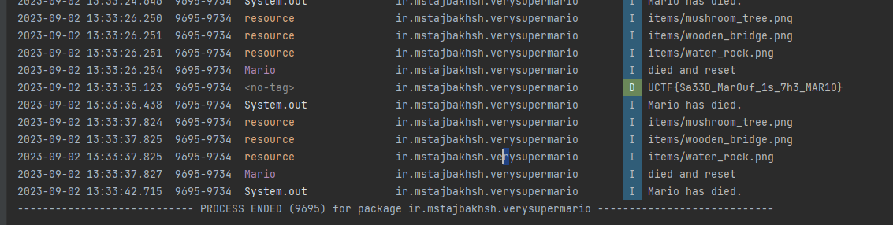

# Urmia CTF | Reverse | Very Super Mario

by h04x and daVinci

### Challenge Text



[APK For download](https://ctfd.uctf.ir/files/fd77af683a2df14b78990c08cc3c1ccb/VerySuperMario.apk?token=eyJ1c2VyX2lkIjoxODMsInRlYW1faWQiOjEwOSwiZmlsZV9pZCI6MTR9.ZPOgNA.WigI38E5GMSZpyuek3IullygdAo)

## First Challenge

### "Reversing" the APK

We were performing this challenge on a Kali box, so our preferred way of reversing the APK was to download the APK to the box and use apktool.

```
> wget https://ctfd.uctf.ir/files/fd77af683a2df14b78990c08cc3c1ccb/VerySuperMario.apk
> apktool d mario.apk
```

The output of this is a file structure.



Based on the file structure, this is obviously a full game of Mario, not something written for this challenge; this led us to look into the game more holistically instead of just guessing.

### The DIFF report

The team's first instinct was to pull a DIFF report on the APK given to us by the challenge and the original SuperMario Android APK that can be found [here](https://github.com/maheshkurmi/-Android-Super-Mario). To reveal all the juicy secrets

To run the diff, we simply unpacked both apps via apktool and ran a diff using diff.

```
> apktool d VerySuperMario.apk
> apktool d SuperMario.apk
> diff -r VerySuperMario SuperMario
```

Performing that DIFF revealed a difference in assets/maps/world1/map1/map3.txt to the map3.txt in the original APK.


This was the beginning of the end.


We compared the two binary files, which wouldn't open in a readable format anywhere other than in VSCode. VSCode still yells at you for trying to open a binary.... and the output isn't very pretty.


But, as you may notice. This is an "ascii" representation of the level. Scrolling over to the right, we see something that doesn't exist in the original.


The "NNNNNN NNNNNN=NNNNNNNNNNN" was the "Bowser Pit" as promised by the challenge text. That WILEY = was the only unique character in the whole map. That must be it.

Let's go see what it is.

## Running in Android Studio and peeking at the logs

The first step was to open the APK in Android Studio using the "Profile or Debug" feature. This would allow us to run the APK in debug mode.



Once opened in Android Studio, I want to play the game. If you have never used Android Studio to run an Android emulator to test, debug, or develop an Android app, you might have to set up an emulated device first. Please use the [Android Studio docs](https://developer.android.com/studio/run/emulator) for this. You can also [use your Android phone](https://developer.android.com/studio/run/device) if you wish.

Once you have the emulator running, you can utilize the built-in logcat feature of Android Studio. It's an immensely powerful debug console that will capture all the device logs while running the emulator (or app on your phone.)



## Getting the flag

When we played World 1, we ran over to the promised Bowser Pit and were greeted by many browsers and.... just a question mark block... Well, it's still the only unique block on the map, so let's dive in head first. Literally, let's go break the box.

Lo-and-behold:



The FLAG!! It's sitting right there on the console (ignore all the death, please...).

`Flag: UCTF{Sa33D_Mar0uf_1s_7h3_MAR10}`
