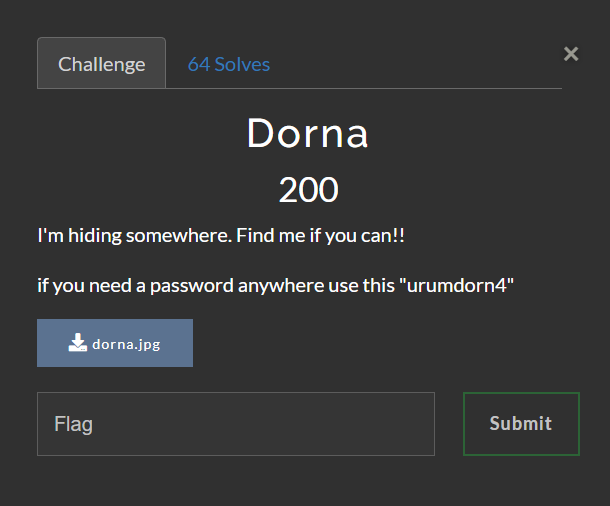
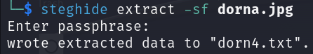

# Urima CTF | Steganography | Dorna 

by h04x

### Challenge Description 



Needed File:

[dorna.jpg](./dorna.jpg)

#### Analyzing the photo

Since this is a Steganography Chall and we have a password given from the description of the chall i immediately try steghide



Running ```steghide extract -sf dorna.jpg``` reveals that there is a file hidden inside the image!
I enter the passphrase give in the chall description and get [this](./dor4.txt) hidden file

#### Getting the Flag 

The file says the given flag is encoded with Base64 so let's encode it using CyberChef and get the Flag!!

`FLAG: UCTF{dorna_lar_yovasi}`
